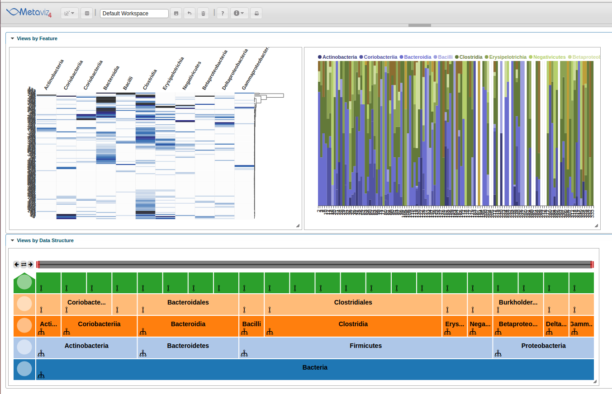

[`Metaviz`](http://metaviz.cbcb.umd.edu) is an interactive visualization tool for metagenomic sequencing data. It supports taxonomy navigation of annotated metagenomic features and allows multiple visualizations of data scatterplots, heatmaps and PCA plots. It has a flexible plugin framework so users can add [d3](http://d3js.org/) visualizations. You can find more information about Metaviz at [http://metaviz.cbcb.umd.edu/help](http://metaviz.cbcb.umd.edu/help).

The `metavizr` package implements two-way communication between the `R/Bioconductor` computational genomics environment and `Metaviz`. Objects in an `R` session can be displayed as tracks or plots on Metaviz Metavizr uses Websockets for communication between the browser Javascript client and the R environmen, the same technology underlying the popular [Shiny](http://www.rstudio.com/shiny/) system for authoring interactive web-based reports in R.

### Preliminaries: the data

In this vignette we will look at the mouse data from the `metagenomeSeq` package.

```{r, eval=TRUE, echo=TRUE, results='hide', warning=FALSE, error=FALSE}
require(metavizr)
require(metagenomeSeq)

data("mouseData")
```

### The metavizr session manager

The connection to `Metaviz` is managed through a session manager object of class `EpivizApp`. We can create this object and open `Metaviz` using the `startMetaviz` function.

```{r, eval=FALSE, echo=TRUE}
app <- startMetaviz()
```

```{r, eval=TRUE, echo=FALSE}

app <- startMetaviz(host="http://localhost", http_port=8989, debug=TRUE, open_browser=FALSE, non_interactive=TRUE, try_ports=TRUE)

# register IciclePlot

js_chart_settings <- list(list(id = "title", type = "string", defaultValue = "", label = "Title", possibleValues = NULL), list(id = "marginTop", type = "number", defaultValue = 50, label = "Top margin", possibleValues = NULL), list(id = "marginBottom", type = "number", defaultValue = 23, label = "Bottom margin", possibleValues = NULL), list(id = "marginLeft", type = "number", defaultValue = 20, label = "Left margin", possibleValues = NULL), list(id = "marginRight", type = "number", defaultValue = 10, label = "Right margin", possibleValues = NULL))

js_chart_colors = c("#1f77b4", "#ff7f0e", "#2ca02c", "#d62728", "#9467bd", "#8c564b", "#e377c2", "#7f7f7f", "#bcbd22", "#17becf")

app$chart_mgr$register_chart_type("epiviz.ui.charts.tree.Icicle", "epiviz.ui.charts.tree.Icicle", js_chart_settings=js_chart_settings, js_chart_colors=js_chart_colors)


# register HeatpmapPlot

js_chart_settings <- list(list("id"="title","type"="string","defaultValue"="","label"="Title","possibleValues"=NULL),list("id"="marginTop","type"="number","defaultValue"=80,"label"="Top margin","possibleValues"=NULL),list("id"="marginBottom","type"="number","defaultValue"=40,"label"="Bottom margin","possibleValues"=NULL),list("id"="marginLeft","type"="number","defaultValue"=120,"label"="Left margin","possibleValues"=NULL),list("id"="marginRight","type"="number","defaultValue"=40,"label"="Right margin","possibleValues"=NULL),list("id"="measurementGroupsAggregator","type"="categorical","defaultValue"="mean-stdev","label"="Aggregator for measurement groups","possibleValues"=list("mean-stdev","quartiles","count","min","max","sum")),list("id"="colLabel","type"="measurementsMetadata","defaultValue"="colLabel","label"="Columns labels","possibleValues"=NULL),list("id"="rowLabel","type"="measurementsAnnotation","defaultValue"="name","label"="Row labels","possibleValues"=NULL),list("id"="showColorsForRowLabels","type"="boolean","defaultValue"=FALSE,"label"="Row labels as colors","possibleValues"=NULL),list("id"="maxColumns","type"="number","defaultValue"=40,"label"="Max columns","possibleValues"=NULL),list("id"="yMin","type"="number","defaultValue"="default","label"="Min Value","possibleValues"=NULL),list("id"="yMax","type"="number","defaultValue"="default","label"="Max Value","possibleValues"=NULL),list("id"="cluster","type"="categorical","defaultValue"="rows","label"="Cluster","possibleValues"=list("none","rows","columns","both")),list("id"="clusteringAlg","type"="categorical","defaultValue"="none","label"="Clustering Algorithm","possibleValues"=list("none","agglomerative")),list("id"="clusteringMetric","type"="categorical","defaultValue"="euclidean","label"="Clustering Metric","possibleValues"=list("euclidean")),list("id"="clusteringLinkage","type"="categorical","defaultValue"="complete","label"="Clustering Linkage","possibleValues"=list("complete")),list("id"="showDendrogram","type"="boolean","defaultValue"=TRUE,"label"="Show Dendrogram","possibleValues"=NULL))

js_chart_colors = c("#1859a9","#ed2d2e","#008c47","#010101","#f37d22","#662c91","#a11d20","#b33893")

app$chart_mgr$register_chart_type("HeatmapPlot", "epiviz.plugins.charts.HeatmapPlot", js_chart_settings=js_chart_settings, js_chart_colors=js_chart_colors)


# register StackedLinePlot

js_chart_settings <- list(list("id"="title","type"="string","defaultValue"="","label"="Title","possibleValues"=NULL),list("id"="marginTop","type"="number","defaultValue"=30,"label"="Top margin","possibleValues"=NULL),list("id"="marginBottom","type"="number","defaultValue"=50,"label"="Bottom margin","possibleValues"=NULL),list("id"="marginLeft","type"="number","defaultValue"=30,"label"="Left margin","possibleValues"=NULL),list("id"="marginRight","type"="number","defaultValue"=15,"label"="Right margin","possibleValues"=NULL),list("id"="measurementGroupsAggregator","type"="categorical","defaultValue"="mean-stdev","label"="Aggregator for measurement groups","possibleValues"=list("mean-stdev","quartiles","count","min","max","sum")),list("id"="colLabel","type"="measurementsMetadata","defaultValue"="colLabel","label"="Color by","possibleValues"=NULL),list("id"="rowLabel","type"="measurementsAnnotation","defaultValue"="name","label"="Labels","possibleValues"=NULL),list("id"="offset","type"="categorical","defaultValue"="zero","label"="Offset","possibleValues"=list("zero","wiggle")),list("id"="interpolation","type"="categorical","defaultValue"="step-after","label"="Interpolation","possibleValues"=list("linear","step-before","step-after","basis","basis-open","basis-closed","bundle","cardinal","cardinal-open","monotone")),list("id"="scaleToPercent","type"="boolean","defaultValue"=TRUE,"label"="Scale to Percent","possibleValues"=NULL),list("id"="useGroupBy","type"="boolean","defaultValue"=FALSE,"label"="Use Group by","possibleValues"=NULL),list("id"="groupBy","type"="measurementsAnnotation","defaultValue"="name","label"="Group By","possibleValues"=NULL),list("id"="hoverOpacity","type"="number","defaultValue"=0.6,"label"="Hover Opacity","possibleValues"=NULL))

js_chart_colors = c("#393b79","#5254a3","#6b6ecf","#9c9ede","#637939","#8ca252","#b5cf6b","#cedb9c","#8c6d31","#bd9e39","#e7ba52","#e7cb94","#843c39","#ad494a","#d6616b","#e7969c","#7b4173","#a55194","#ce6dbd","#de9ed6")

app$chart_mgr$register_chart_type("StackedLinePlot", "epiviz.plugins.charts.StackedLinePlot", js_chart_settings=js_chart_settings, js_chart_colors=js_chart_colors)

app$server$start_server()

```
This opens a websocket connection between the interactive `R` session and the browser client. This will allow us to visualize data stored in the `Metaviz` server along with data in the interactive `R` session.

----
*Windows users:* In Windows platforms we need to use the `service` function to let the interactive `R` session connect to the `epiviz` web app and serve data requests. We then escape (using `ctl-c` or `esc` depending on your environment) to continue with the interactive `R` session. This is required anytime you want `metavizr` to serve data to the web app, for example, when interacting with the UI. (We are actively developing support for non-blocking sessions in Windows platforms).

```{r, eval=TRUE}
app$server$service()
```
----

### Adding Icicle plot to explore metagenomic Features

Once the browser is open we can visualize the metagenomic features from the `mouseData` object. We use the `plot` method to do so. 

```{r,eval=TRUE}
icicle_plot <- app$plot(mouseData, datasource_name="mouseData")
```

You should now see an icicle tree plot to explore the hierarchy of the metagenomic features from the `mouseData` object.

### Visualizing count matrix from the `mouseData` MRExperiment object

To get the count matrix from `mouseData`

```{r,eval=FALSE, echo=TRUE}
MRcounts(mouseData)
```

To visualize the count matrix, create a `metavizControl` object. The `metavizControl` object defines various settings like aggregation depth, normalization method, aggregate function etc. on the dataset.

```{r, eval=TRUE}
control = metavizControl(aggregateAtDepth=3,aggregateFun=function(x) colSums(x),
                          valuesAnnotationFuns=NULL,maxDepth=4,maxHistory=3,maxValue=NULL,
                          minValue=NULL,title="",n=10000,rankFun=sd,norm=TRUE,log=FALSE)
```

First, we'll create a heatmap visualization of the count matrix. For this lets choose all mouse samples whose diet is "Western"

```{r,eval=TRUE}
sampleIds = which(phenoData(mouseData)$diet == "Western")
```

We'll then use the `control` object to query for count matrix and plot a heatmap on the metaviz workspace.

```{r, eval=TRUE}

  # from control object
  norm=control$norm
  log = control$log
  n   = control$n
  rankFun = control$rankFun
  
  # query for counts
  mat = MRcounts(mouseData,norm=norm,log=log)
  
  # Since mouse data has > 10000 features choose a subset of features where normalized count values are > 5000
  otusToKeep = which(rowSums(mat) > 5000)
  n = min(length(otusToKeep),n)
  otuStats = apply(mat[otusToKeep,], 1, rankFun)
  otuIndices = otusToKeep[order(otuStats, decreasing = TRUE)[1:n]]
```

Now we have the OTU Matrix, lets add this data to metavizr as a new data source.

```{r, eval=TRUE}
  heatMapObj = app$data_mgr$add_measurements(mouseData[otuIndices,], datasource_name = "heatmapObj")
  measurements = heatMapObj$get_measurements()
  heatmap = app$chart_mgr$visualize("HeatmapPlot", measurements[sampleIds])
```

Using the same data, we can also visualize it in a stacked plot to see the abundance of various features across samples. Since the measurements are already added to metavizr, we only need to add a stacked line plot. 

```{r, eval=TRUE}
  stackedPlot = app$chart_mgr$visualize("StackedLinePlot", measurements[sampleIds])
```

The screenshot of the above workflow on the metaviz workspace.



Another feature of metavizr is to visualize data using a line plot.  To illustrate, we describe a use case with data from Pop et al. [1].  In the study, 12 subjects were exposed to enterogenic E. coli and then treated with antibiotics.  Samples were collected at 2 days before treatment and then on each day afterwards for 10 days.  Paulson et al. describe analyzing this time series data with a smoothing-spline [2].  We detail the steps to perform this analysis and create a line plot using Metaviz. 

First, import the etec16s dataset, select sample data from the first 9 days, and choose the feature annotations of interest.

```{r, eval=TRUE}
library(etec16s)
data(etec16s)
etec16s = etec16s[,-which(pData(etec16s)$Day>9)]
featuresOfInterest = c('Escherichia/Shigella','Faecalibacterium prausnitzii')
```

Next, use metagenomeSeq to fit a smoothing-spline to the time series data.

```{r, eval=TRUE}
timeSeriesFits = lapply(bacteria,function(i){
  try(
    fitTimeSeries(obj=etec16s,
                  formula = abundance~id + time*class + AntiGiven,
                  feature=i,
                  class="AnyDayDiarrhea",
                  id="SubjectID",
                  time="Day",
                  lvl="Species",
                  C=0.3,
                  B=1)
  )
})
```

For plotting the data using Metaviz, we set the fit values as y-coordinates and timepoints as x-coordinates.  We need to create two AnnotatedDataFrame objects which contain the timepoints as sample data and annotations for feature data.  

```{r, eval=TRUE}
results <- rbind(t(timeSeriesFits[[1]]$fit)[1,], t(timeSeriesFits[[2]]$fit)[1,])

dfSamples <- data.frame(x=1:11,row.names=paste("Timepoint", 1:11, sep="_"))
metaDataSamples <-data.frame(labelDescription="timepoints")
annotatedDFSamples <- AnnotatedDataFrame()
pData(annotatedDFSamples) <- dfSamples
varMetadata(annotatedDFSamples) <- metaDataSamples
validObject(annotatedDFSamples)

dfFeatures <- data.frame(taxonomy1 = c("bacteria", "bacteria"),taxonomy2=featuresOfInterest)
metaDataFeatures <-data.frame(labelDescription=c("taxonomy1", "taxonomy2"))
annotatedDFFeatures <- AnnotatedDataFrame()
pData(annotatedDFFeatures) <- dfFeatures
varMetadata(annotatedDFFeatures) <- metaDataFeatures
validObject(annotatedDFFeatures)
```

Finally, we create an MRexperiment with the x-coordinates and y-coordinates as well as the sample and feature data AnnotatedDataFrames.  We then start a Metaviz session and add the MRexperiment as a measurement for Metaviz to plot.

```{r, eval=TRUE}
splinesMRexp <- metagenomeSeq:::newMRexperiment(counts = results, phenoData = annotatedDFSamples, featureData = annotatedDFFeatures)
app <- startMetaviz()
app$data_mgr$add_measurements(splinesMRexp, datasource_name = "splines", control = metavizControl(norm=FALSE))
```


### Close Metavizr and end session

To close the connection with metaviz and the R session, we use the stop_app function.

```{r,eval=TRUE}
  app$stop_app()
```

### SessionInfo

```{r session-info, cache=FALSE}
sessionInfo()
```

References:

[1] Pop, M., Paulson, J.N., Chakraborty, S., Astrovskaya, I., Lindsay, B.R., Li, S., Bravo, H.C., Harro, C., Parkhill, J., Walker, A.W. and Walker, R.I., 2016. Individual-specific changes in the human gut microbiota after challenge with enterotoxigenic Escherichia coli and subsequent ciprofloxacin treatment. BMC genomics, 17(1), p.1.

[2] Paulson J.N., Talukder H., and Bravo H.C, Longitudinal differential abundance analysis of microbial marker-gene surveys using smoothing splines. In Submission. 

